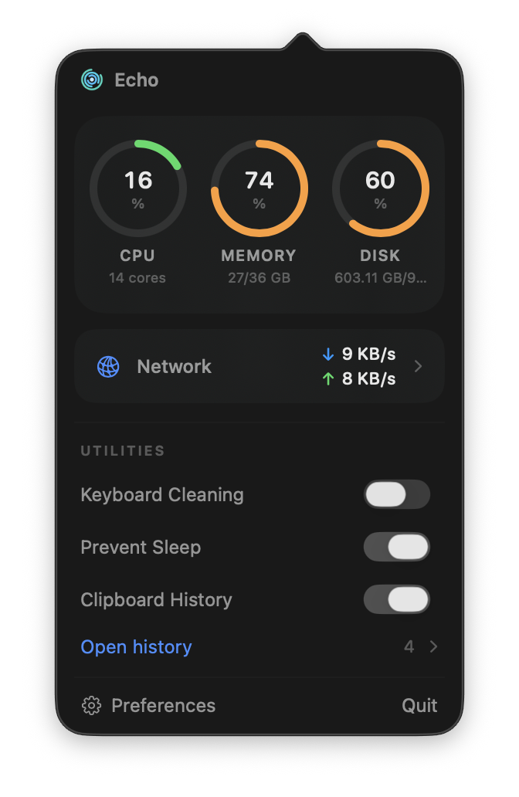
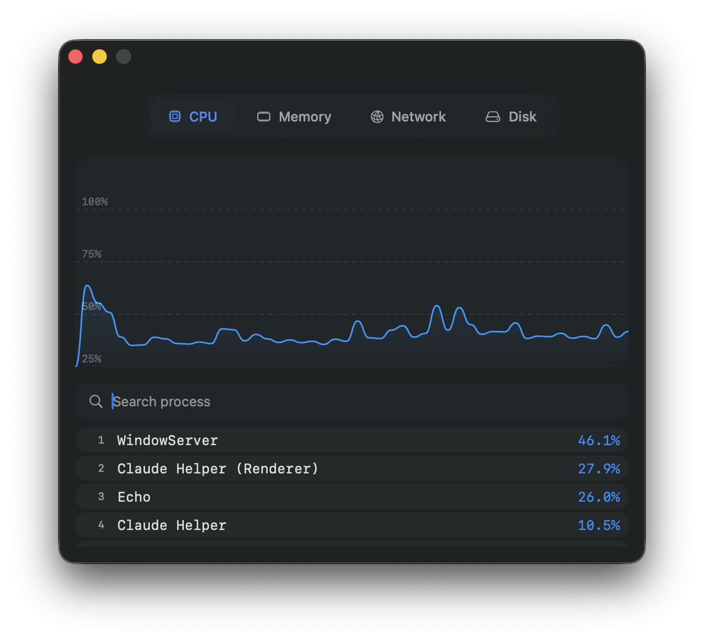
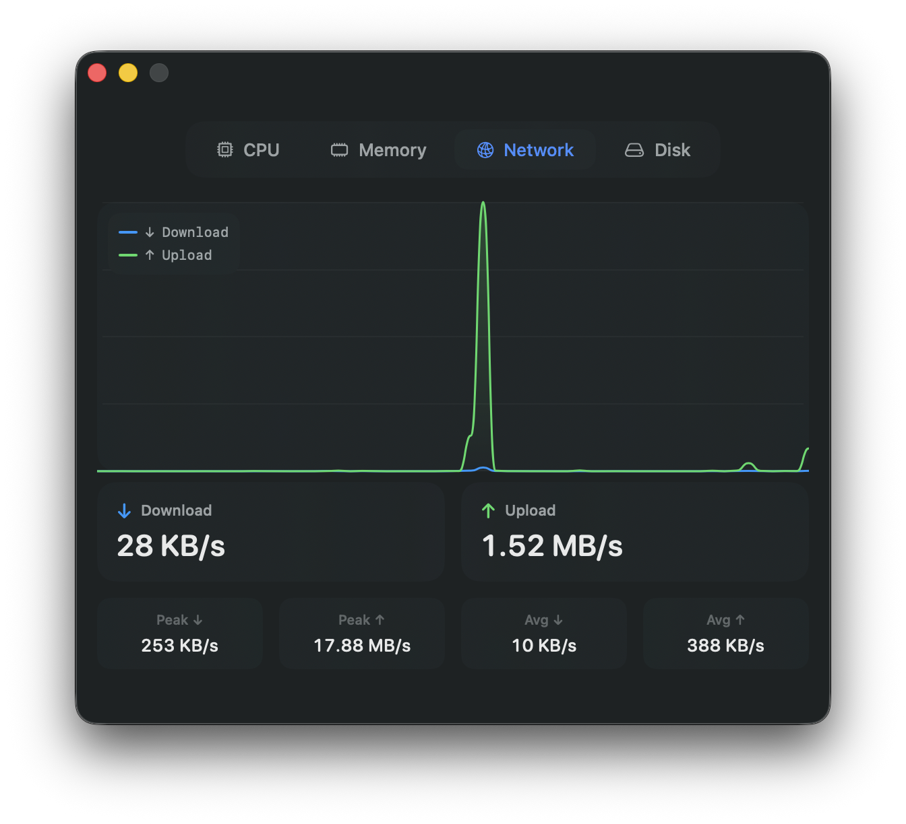
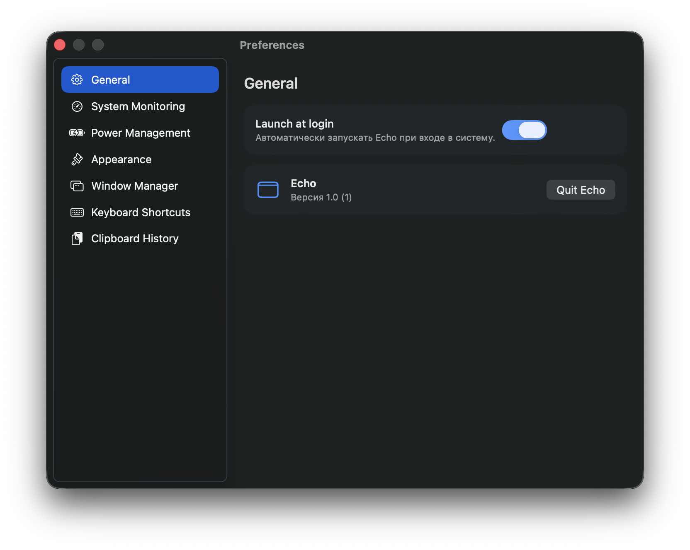

<div align="center">

# Echo

**A native macOS menu-bar system monitor — all in one place.**

Live CPU, RAM, disk and network readings in your menu bar, with built-in window
management, clipboard history and quick system utilities.



</div>

---

## Screenshots

<table>
  <tr>
    <td width="50%"><br><sub>CPU — live chart and top processes</sub></td>
    <td width="50%"><br><sub>Network — throughput, peaks and averages</sub></td>
  </tr>
  <tr>
    <td colspan="2" align="center"><br><sub>Preferences — General</sub></td>
  </tr>
</table>

## Features

- **System monitoring** — CPU, memory, disk and network in a compact popover with
  CPU / MEM / DISK rings and live network throughput.
- **Drill-down detail windows** — per-metric charts plus top-10 lists: heaviest
  CPU processes, largest memory consumers, and biggest files on disk (jump straight
  to a file in Finder).
- **Window manager** — tiling via Accessibility, global hotkeys, and drag-to-snap
  (drag a window to a screen edge/corner to tile it; hold Shift to cancel).
- **Clipboard history** — recent text, images and files, with secret/transient
  entries skipped. Everything stays in memory.
- **Quick utilities** — Keyboard Cleaning, Prevent Sleep, and disk cleanup via the
  [`mole`](https://github.com/tw93/mole) CLI.
- **Energy-aware** — pauses monitoring when no window is open, during system sleep,
  and throttles in Low Power Mode (all configurable).

## Requirements

- macOS 26.1 or later.
- The app is **not sandboxed** (required for process inspection, Accessibility-based
  window management, etc.).

## Install

### Download (recommended)

1. Grab the latest `Echo-x.y.dmg` from [**Releases**](../../releases).
2. Drag **Echo.app** into **Applications**.
3. The build is ad-hoc signed and not notarized, so on first launch:
   **right-click Echo.app → Open → Open**.
   (Or remove the quarantine flag: `xattr -dr com.apple.quarantine /Applications/Echo.app`.)
4. For window management, grant access in
   **System Settings → Privacy & Security → Accessibility**.

### Bypassing Gatekeeper (unsigned build)

Because Echo is not signed with an Apple Developer certificate, macOS may block it with a "damaged or can't be opened" warning. Two ways to fix this:

**Option 1 — Remove quarantine flag (recommended)**

This removes the quarantine attribute from the specific app without changing any system settings.

1. Open **Terminal** (find it via Spotlight: `⌘ Space` → type _Terminal_).
2. Run the following command, then drag **Echo.app** from Applications into the Terminal window — the path will be appended automatically:
   ```
   sudo xattr -r -c
   ```
   > **Note:** the command does not work on files inside a mounted `.dmg`. Copy the app to your Desktop (or Applications) first, then run the command on the copied app. In some cases you can also run it on the `.dmg` file before mounting.
3. Press **Enter** and type your administrator password. The password is not shown while typing — this is normal. If you have no password set, create one first.
4. Launch Echo. macOS will verify the app (this can take up to 30 minutes on first run) and then open it.

**Option 2 — Disable Gatekeeper system-wide**

This restores the _"Allow apps from Anywhere"_ option in System Settings → Privacy & Security. Only do this if Option 1 does not work for you.

1. Open **Terminal** and run the appropriate command for your macOS version:

   macOS 10.12 – 10.15.7:
   ```
   sudo spctl --master-disable
   ```
   macOS 11 and later:
   ```
   sudo spctl --global-disable
   ```
   To re-enable Gatekeeper later, replace `disable` with `enable`.

2. Press **Enter** and type your administrator password.
3. Launch Echo normally.

---

### Build from source

```bash
git clone <repo-url>
cd MonitorBarApp
open MonitorBarApp.xcodeproj   # build & run in Xcode (⌘R)
# or quick run:
./run.sh
```

> Tip: in Xcode → target → Signing & Capabilities, select a Team (a free Apple ID
> works). A stable signature keeps Accessibility permission across rebuilds.

## Keyboard shortcuts

Defaults (editable in Preferences → Keyboard Shortcuts):

| Shortcut | Action |
| --- | --- |
| ⌃⌘ ← / → / ↑ / ↓ | Left / Right / Top / Bottom half |
| ⌃⌘ U / I | Top-left / Top-right corner |
| ⌃⌘ N / M | Bottom-left / Bottom-right corner |
| ⌃⌘ J | Maximize (fill visible area) |
| ⌃⌘ K | Center (shrink and center) |
| ⌘⇧ V | Open Clipboard History |

## Preferences

- **General** — launch at login.
- **System Monitoring** — update interval (0.5–5 s).
- **Power Management** — pause when no window is open, pause during system sleep,
  throttle in Low Power Mode.
- **Appearance** — System / Light / Dark.
- **Window Manager**, **Keyboard Shortcuts**, **Clipboard History**.

## Privacy

Echo runs entirely on your Mac. No accounts, no telemetry, no network calls for its
own purposes — all metrics and clipboard data stay local.

## Packaging & releases

```bash
./scripts/make-dmg.sh        # build Release and produce dist/Echo-<version>.dmg
./scripts/release.sh 1.0     # build DMG, tag, and publish a GitHub Release (needs gh)
```

## Architecture

SwiftUI + Swift 6 with `SWIFT_STRICT_CONCURRENCY = complete`. Monitors are `actor`s
collected in parallel by `MetricsService` (`async let`); a single `MenuBarController`
owns the shared services and injects them into the popover and detached windows.
See `ARCHITECTURE.md` and `DEVLOG.md` for details.

## License

MIT — see `LICENSE`. The bundled disk-cleanup feature shells out to the separate
MIT-licensed [`mole`](https://github.com/tw93/mole) CLI.
